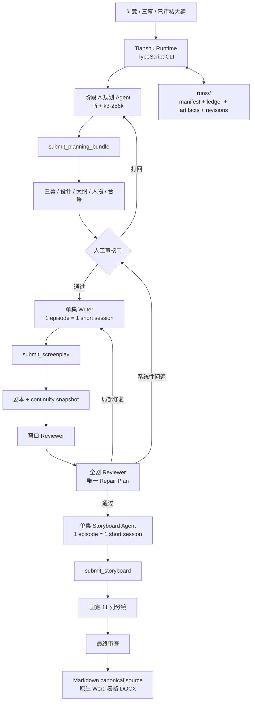

# TianshuAgent 架构与实施计划

## 1. 决策摘要

TianshuAgent 保留旧天书的短剧方法、两阶段人工审核、固定 11 列分镜合同和确定性质量门。模型侧改用 Pi Coding Agent SDK + `kimi-coding/k3-256k`，不再维护旧的直接 LLM 调用和多节点调度。

这里不做通用多 Agent 平台。Agent 在明确的内容合同、项目资料和提交工具里写作、审稿、修复。用户最后只拿到 Markdown 和 DOCX 分镜剧本。

### 已确认的设计

- 生产默认模型：`kimi-coding/k3-256k`。`kimi-coding/k3` 只作为人工批准后的长上下文升级选项。
- 阶段 A：一句话创意/三幕 → 设计发散 → 分集大纲 → 人物圣经 → 人工审核。
- 阶段 B：剧本完成并通过全剧审稿后，才生成固定 11 列分镜。
- 剧本与分镜：**每 5 集 = 1 个持续 Pi Session**，第 6 集起创建新 session；不跨角色复用 session。
- 生产 session 使用 `SessionManager.inMemory()`；session 历史是批内创作辅助，不是项目事实来源。
- 项目事实以版本化纯文件 artifacts、台账和连续性快照为准。
- 目标市场也是 canonical contract：目标国家决定人物命名、城市、机构、家庭/金钱制度、道具、服装与文化锚点；制作语言不能覆盖这个约束。
- 不建设数据库、服务端、MCP、看板、飞书交付或通用多 Agent 平台。
- 对外交付仅为 `<剧名>｜分镜剧本.md` 与 `<剧名>｜分镜剧本.docx`。

## 2. 旧天书：保留、替换与舍弃

| 旧天书资产 | TianshuAgent 处理方式 | 原因 |
|---|---|---|
| `PHILOSOPHY.md` / `CRAFT.md` | 保留为创作方法基线，并按角色拆成短指令/技能 | 内容方法比调用方式更有价值；不能将整本材料重复塞进每次上下文 |
| 三幕→设计→大纲→人物→剧本→分镜分层 | 保留 | 规则应落在决定结构的上游层 |
| 两阶段人工审核 | 保留 | 阶段 A 是全剧地基，不应由自动化绕过 |
| `calibers.js` 的单一数值口径 | 迁移为 `contracts/calibers.ts` | 消除 Prompt、工具、检查器间的数字漂移 |
| 文件落盘、断点续跑、残桩检测 | 保留并强化 revision/digest | 可审计、可恢复、无需数据库 |
| 11 列分镜合同 | 严格保留 | 是目标交付物合同 |
| 直接 OpenAI 兼容节点池、流式续写、节点健康路由 | 替换为 Pi SDK session/runtime | Pi 负责模型会话与工具调用；无需复刻旧网络调度层 |
| HTML 看板、飞书写回、HTML 对外交付 | 不进入 V1 | 最终需求只保留 Markdown 与 DOCX |
| 旧式批量 LLM 调用 | 替换为短生命周期 Agent session + `submit_*` 工具 | 将自检与定向修复放入受控 Agent 回合 |

## 3. 总体架构



## 4. 项目事实与 Context Compiler

### 4.1 纯文件状态

```text
runs/<run-id>/
├── manifest.json
├── events.jsonl
├── canonical/
│   ├── market.json
│   ├── market-contract.md
│   ├── acts.md
│   ├── design.md
│   ├── outline.md
│   ├── characters.md
│   └── ledger.json
├── screenplay/ep-01.md
├── storyboard/ep-01.md
├── continuity/ep-01.json
├── reviews/
├── research/
├── work/<task-id>/
├── tasks/
└── deliverables/
```

`canonical/`、`screenplay/`、`storyboard/`、`continuity/`、`reviews/` 和已批准的 `research/` 是只读 canonical artifacts；`work/<task-id>/` 是当前 Agent 唯一可编辑的 scratch workspace。`manifest.json` 是全剧状态；`tasks/*.json` 是每个可恢复单元的状态。Agent session 文件、日志、目录 mtime 均不是项目事实。

### 4.1.1 市场与文化合同

Planner 必须随规划包提交 `market`：国家、主要故事地点、人物命名方式、社会制度语境和至少两个文化锚点。Runtime 由用户 brief 推断目标市场并做一致性验证；Writer、Storyboard 和 Reviewer 每次任务均读取 `market-contract.md`。脚本/分镜在 `run_checks` 时同时检查目标国家锚点和已知错误市场遗留词。以“美区”为例，中文可以是制作说明语言，但故事人物不能再使用中国姓名、温家式宗族关系或中国机构空间。

### 4.2 Agent Artifact Guide

每个 Agent 的角色指令与 Context Bundle 都包含以下 artifact 导航约定。Agent 可以探索项目，但必须理解“读到的内容”和“可修改的草稿”是不同层：

| 区域 | 用途 | Agent 权限 |
|---|---|---|
| `canonical/` | 三幕、设计、大纲、人物、台账 | 按需只读 |
| `screenplay/` | 已批准单集剧本 | 按需只读 |
| `storyboard/` | 已批准单集 11 列分镜 | 按需只读 |
| `continuity/` | 每集真实末态、钩子、持物与已知信息 | 按需只读 |
| `reviews/` | Window/全剧审稿与 Repair Plan | 按需只读 |
| `research/` | 有来源、适用范围和 digest 的外部研究笔记 | 按需只读；Planner 可提交新增笔记 |
| `work/<task-id>/` | 当前任务的 `draft.md`、`notes.md`、`check-report.json` | 当前任务可读写 |
| `deliverables/` | 已通过 gate 的最终 Markdown/DOCX | 只读；只有 Runtime 渲染写入 |

Artifact 工具使用稳定引用，例如 `canonical/ledger.json`、`screenplay/ep-12.md` 或 `continuity/ep-11.json`。每次读取在 task evidence 中记录 artifact ref 与 digest，便于审计 Agent 的依据。

### 4.3 Context Bundle

每次 Agent 调用前，代码按固定顺序编译**基线**上下文，确保常规任务无需额外工具即可开始。基线不是全部上下文；Agent 若发现事实缺口，可读取或搜索 canonical artifacts。单集 Writer 的 bundle 包含：

```text
角色指令与合同版本
故事台账 ledger
人物圣经
本集、前一集、后一集的大纲
上一集真实末态 continuity snapshot
首集风格锚定（非首集）
当前已批准的修复意见（如有）
contextDigest
```

`contextDigest` 绑定本次任务。若上游 artifact、台账或上一集末态发生变化，旧 bundle 的提交被拒绝；下游依赖任务标记为 `stale`。

## 5. Pi Session 与工具设计

### 5.1 Session 策略

| 任务 | Session 范围 |
|---|---|
| 阶段 A 规划 | 一部剧一个短 session |
| 剧本 | 5 集一个持续 session（ep01–05、ep06–10…） |
| 分镜 | 5 集一个持续 session（ep01–05、ep06–10…） |
| 窗口审稿 | 一个窗口一个新的只读 session |
| 全剧审稿 | 一个新的只读 session |

每个 Writer/Storyboard session 只覆盖连续 5 集；下一批必须创建新 session，并注入台账、人物、上一批真实末态、当前批大纲和首批风格锚定。故事连续性始终由 artifacts 与 Context Bundle 保证，不能依赖 session 历史。

### 5.2 生产工具：受治理的探索能力

生产 Agent 不只跑一次 Prompt。它先拿到基线 Context Bundle；信息不够时，可以在预算内读取 artifacts、搜索事实、编辑 task sandbox、运行检查或研究外部背景，再提交候选。

| 工具 | 允许角色 | 作用与边界 |
|---|---|---|
| `list_artifacts` | 全部 | 列出可访问 artifact 的 ref、revision、digest 与摘要；只读 |
| `read_artifact` | 全部 | 按 ref/range 读取 canonical artifact；记录 evidence；只读 |
| `search_artifacts` | 全部 | 在授权范围内搜索名字、道具、钩子、编号和历史审稿；只读 |
| `read_draft` / `write_draft` / `edit_draft` | Planner、Writer、Storyboard Agent | 仅操作 `work/<task-id>/`，不得写 canonical artifacts |
| `run_checks` | Planner、Writer、Storyboard Agent | 对 scratch draft 返回结构化确定性 findings；不写正式产物 |
| `research_web` | Planner 默认；Writer/Storyboard 按策略 | 有 purpose、来源数/时长预算、来源记录与不可信外部内容隔离 |
| `submit_research_note` | Planner；Repair Plan 明确授权的 Writer | 将来源、摘要、适用范围提交到 `research/` |
| `submit_planning_bundle` | Planner | 原子提交三幕、设计、大纲、人物、台账 |
| `submit_screenplay` | Writer | 原子提交当前集剧本与 continuity snapshot |
| `submit_storyboard` | Storyboard Agent | 原子提交当前集固定 11 列分镜 |
| `submit_review` | Reviewer | 提交结构化审稿报告；不能直接改稿 |

不开放任意路径 `bash`、直接写 `runs/` canonical artifacts、裸 HTTP 请求或任意浏览器控制。开发模式可用单独的 feature flag 开诊断工具；生产研究必须走 `research_web`，这样来源、抓取范围和外部提示都能管住。

工具注册表允许扩展，但新工具必须有 schema、版本、feature flag、fixture 测试、明确权限和失败语义；先实验性启用，再进入生产默认工具集。

### 5.3 提交与修复循环

```text
读取/搜索/研究（按需）
→ 在 `work/<task-id>/` 草稿迭代
→ `run_checks`
→ `submit_*`
→ PASS：原子提升为 canonical artifact
└→ REJECTED：返回精确硬门错误 → 在 scratch 中定向修订一次
                                         └→ 再失败：blocked，升级
```

Runtime 直接提供基线上下文，不要求 Agent 每次先调 `get_context`。实验里，这种强制首轮读取只多了一次模型和工具往返，也带来空结束和长等待。Agent 发现真实信息缺口时，仍可主动 `read_artifact`、`search_artifacts` 或研究外部背景。

## 6. 两阶段工作流

### 阶段 A：规划与人工审核

```text
输入 → Planner → submit_planning_bundle → 硬检查 → awaiting_approval
```

人工审核可选择 `approved` 或 `returned`。只有 `approved` 才能进入阶段 B。

### 阶段 B：生产与审查

```text
ep01–epN 剧本（连续 5 集一批，批间顺序）
→ 剧本硬检查
→ 窗口审稿 + 全剧审稿
→ 已批准的局部修复
→ ep01–epN 分镜（连续 5 集一批，批间顺序）
→ 分镜硬检查 + 最终审查
→ 交付
```

分镜必须等待剧本全剧审稿结束；不得先拆分镜、再回头大修剧本。

## 7. 质量门与 Repair Plan

### 7.1 确定性门

代码负责验证：

- 规划包齐全、目标集数合法、集数覆盖完整；
- 剧本集号、双语格式、钩子、连续性字段、残桩、人物数等；
- 分镜固定 11 列、列顺序、镜号、镜数、建议时长、累计时长、总时长、日夜与关键单元格；
- 台账 token 不漂移、依赖 revision 未过期；
- Markdown 与 DOCX 使用同一 revision。

### 7.2 语义审稿

Window Reviewer 发现并举证局部问题；全剧 Reviewer 汇总所有窗口报告与台账，输出唯一 `Repair Plan`。全剧 Reviewer 有最终修复决策权，Window Reviewer 没有直接重修权。

Repair Plan 为每个 Writer 编译最小修复包：修复范围、原始证据、必须保留内容、相邻约束、不得改动项与可执行指令。

| 结果 | 动作 |
|---|---|
| 硬门失败 | 当前 Agent 定向重提一次 |
| `P2` / `minor` | 记录，不自动大修 |
| 1–2 个 `P1` | 执行 Repair Plan，复审受影响窗口 |
| 任一 `P0` | 阻止后续阶段或交付 |
| 同类 `P1` 覆盖至少 3 集 | 视为上游问题，停止逐集补丁并升级人工审核 |

## 8. 交付

Markdown 是唯一内容源。assemble 按集号拼接已通过检查的 `storyboard/ep-N.md`；不使用 LLM 改写或重排。

DOCX 渲染器必须生成原生 OOXML Word 表格：横向页面、11 列、重复表头、固定列宽、多行台词/画面段落和中英字体。不得使用将 Markdown 当作普通文本转换的 `textutil` 方案作为正式渲染器。

内部 `delivery.json` 记录源分镜 digest、Markdown digest、DOCX 来源 digest 与合同版本；用户只收到 Markdown 和 DOCX。

## 9. CLI、状态与恢复

```bash
tianshu plan <input>
tianshu status <run-id> [--json]
tianshu approve <run-id>
tianshu return <run-id> --note "..."
tianshu produce <run-id>
tianshu review <run-id>
tianshu repair <run-id>
tianshu deliver <run-id>
tianshu resume <run-id>
```

状态机：

```text
draft → planning → awaiting_approval → approved
→ screenplay_producing → screenplay_review
→ storyboard_producing → final_review
→ ready_to_deliver → delivered
```

异常状态：`returned`、`repair_required`、`blocked`、`failed`、`cancelled`。

`resume` 只跳过同时满足“artifact 存在、digest 正确、context 未 stale、硬门通过”的任务。单集修复会使其分镜与下游依赖集变 stale，不会无差别重跑整部剧。每个 run 以 `.lock` 防止双写。

## 10. Session Topology 实验结论

在 `kimi-coding/k3-256k`、同一 5 集 fixture、同一 11 列合同下：

| 指标 | 持久 session | 无持续 session |
|---|---:|---:|
| 完成剧本 / 分镜 | 5 / 5 | 5 / 5 |
| 总耗时 | 850.3 秒 | 818.1 秒 |
| 独立审稿 | `minor`，1 blocker | `minor`，0 blocker |
| 生产 session | 3 | 11 |

带 usage 采集的复验中，持续组用时 671.5 秒，无持续组用时 730.1 秒；持续组约快 8.7%，但 SDK reported total usage 更高。因此 V1 的明确取舍是**优先速度**：Writer 与 Storyboard 默认采用“连续 5 集 = 1 个持续 Pi Session + 显式 Context Bundle”。下一批新建 session；全剧 Reviewer 仍必须是新的独立 session。后续 replicate 继续记录 Pi usage、cache-read、输出 token、时长、修复次数和盲审结果。

实验 harness 位于：

- `src/session-topology-experiment.mjs`
- `fixtures/session-topology-5ep-v1.json`

## 11. 实施顺序与验收

### M0：基础合同与实验收口

- 固化模型、tool registry、Context Bundle、manifest/revision/digest。
- 增加 usage/caching 采集，完成第二个实验 replicate。

### M1：阶段 A

- 实现 Planner、`submit_planning_bundle`、人工审核状态与规划包检查。
- 使用旧天书 fixture 验证三幕、设计、大纲、人物、台账输出。

### M2：剧本与审稿

- 实现单集 Writer、连续性快照、窗口审稿、全剧 Reviewer、Repair Plan 与 stale 传播。

### M3：分镜与交付

- 实现 11 列 Storyboard Agent、分镜硬门、原生 DOCX 表格渲染、Markdown/DOCX delivery gate。

### M4：生产验证

- 使用冻结输入对比旧天书；验证内容质量、恢复、修复、交付和 token/耗时。

任何性能优化都不得先于质量非劣验证：不默认引入持久 session、跨集并发、context 裁剪或降低思考等级。

## 12. 当前边界

本文件是已批准的实施蓝图，不代表已经开始生产系统重构。现有仓库仅包含临时 Pi SDK session topology 实验 harness；后续实现、提交、推送和发布均需用户明确指令。
